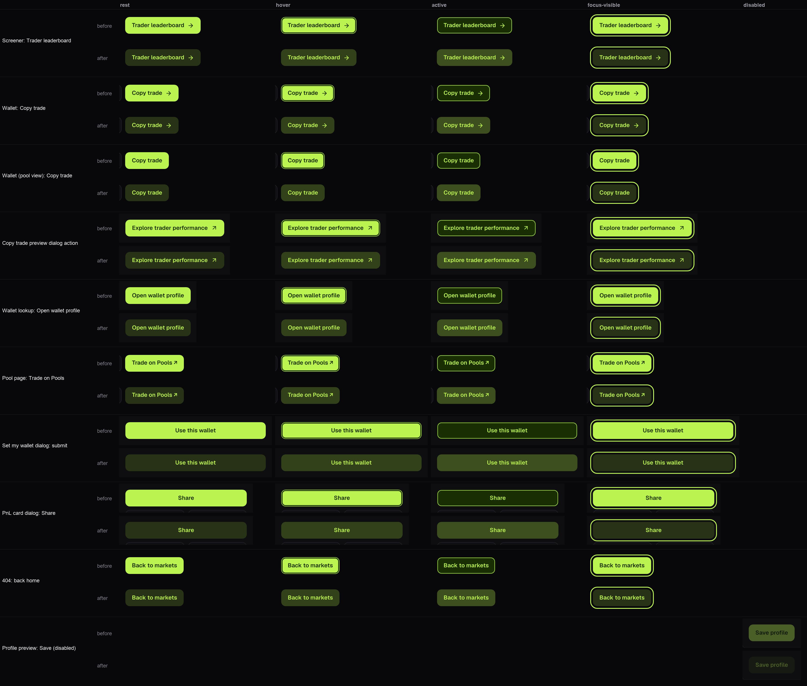
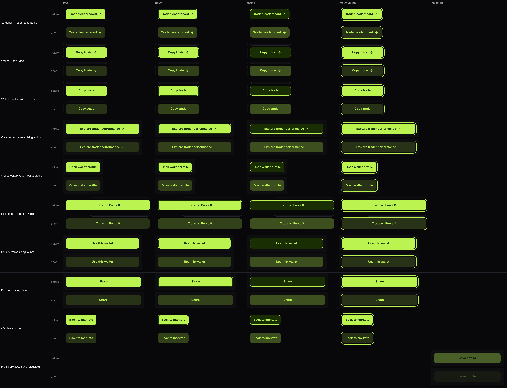

# Primary button restyle evidence

The captain rejected the primary `.button` as a neon block with a black outline. Reproduced on the production build against the production read API at 1440x1000 and 390x844 (2x): every primary consumer computed a solid `#bbf451` fill with `#192e03` text, hover added a 2px inset `#192e03` ring (the black outline), pressed inverted to a `#192e03` fill with a 1px lime ring, and the 4px-offset lime focus ring framed the neon block with a dark gap.

## Consumers

Found by class (`className="button"` without `secondary`), not by page:

| Consumer                         | Source                                            |
| -------------------------------- | ------------------------------------------------- |
| Screener Trader leaderboard      | `product-explore.tsx` (`.button.leaderboard-cta`) |
| Wallet Copy trade                | `product-wallet.tsx`                              |
| Wallet (pool view) Copy trade    | `details.tsx` via `FeaturePreview`                |
| Copy trade preview dialog action | `feature-preview.tsx`                             |
| Profile preview Save (disabled)  | `feature-preview.tsx`                             |
| Open wallet profile              | `lookup.tsx`                                      |
| Trade on Pools                   | `observed-pool-detail.tsx`                        |
| Use this wallet                  | `wallet-profile.tsx`                              |
| PnL card Share                   | `pnl-card-modal.tsx`                              |
| Back to markets                  | `not-found.tsx` (and `error.tsx`)                 |

`live-ui.tsx`'s audit action and `watchlist-controls.tsx`'s shared-list save use the same class and inherit the same rules.

## Treatment

The design export's primary is a 10px-radius, 13px/600 accent fill with no border. pools.xyz's own lime call to action is a 12% lime tint with lime text, no border, and an 18% tint on hover. The Uniswap explore primary is a solid fill with light text, no border, 12px radius and medium weight. This keeps the export's geometry, radius and weight, and takes the tint-with-accent-text treatment:

| Token                         | Value                           | Derivation                                   | Lime text contrast |
| ----------------------------- | ------------------------------- | -------------------------------------------- | ------------------ |
| `--control-primary-bg`        | `#283217`                       | `#bbf451` over `--color-bg` `#08080a` at 18% | 10.37:1            |
| `--control-primary-hover-bg`  | `#33411b`                       | same at 24%                                  | 8.46:1             |
| `--control-primary-active-bg` | `#3e4f1f`                       | same at 30%                                  | 6.90:1             |
| `--control-primary-fg`        | `#bbf451`                       | `--color-accent`                             |                    |
| border                        | `1px solid transparent`         | unchanged                                    |                    |
| focus                         | `2px solid #bbf451`, 4px offset | unchanged global ring                        |                    |
| disabled                      | `opacity: 0.35`                 | unchanged                                    |                    |

The fills are precomputed hex rather than translucent, so a button reads the same on the page, a panel or a dialog. No state draws a box shadow.

## Before and after grid

`capture-states.cjs` forces each state with CDP `CSS.forcePseudoState` on the real element and records its computed style; `state-grid.py` lays out the crops.

| Viewport | Grid                                                    |
| -------- | ------------------------------------------------------- |
| 1440px   |  |
| 390px    |    |

## Measurements

Across all 10 consumers, both widths and every captured state, the box geometry (width, height, padding, radius, font size and weight) is identical before and after, and every consumer computes the same background, text colour, border, shadow and outline in each state. Only colours changed, so no box moves.
