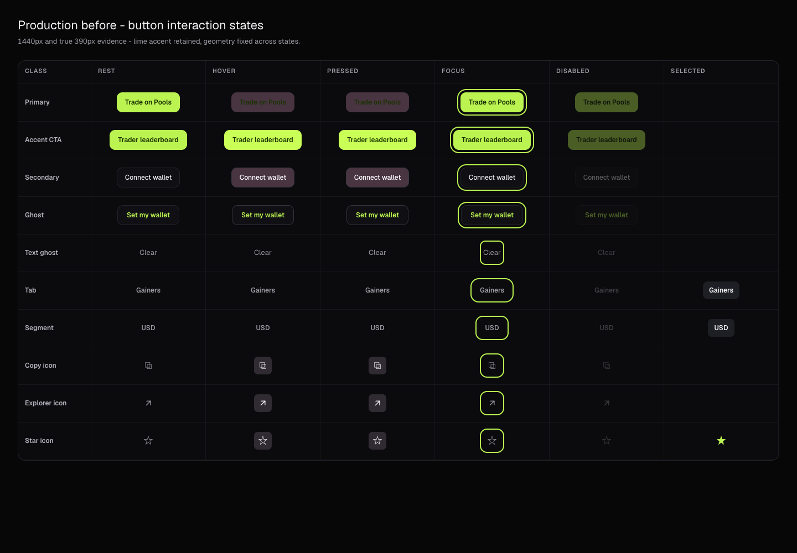
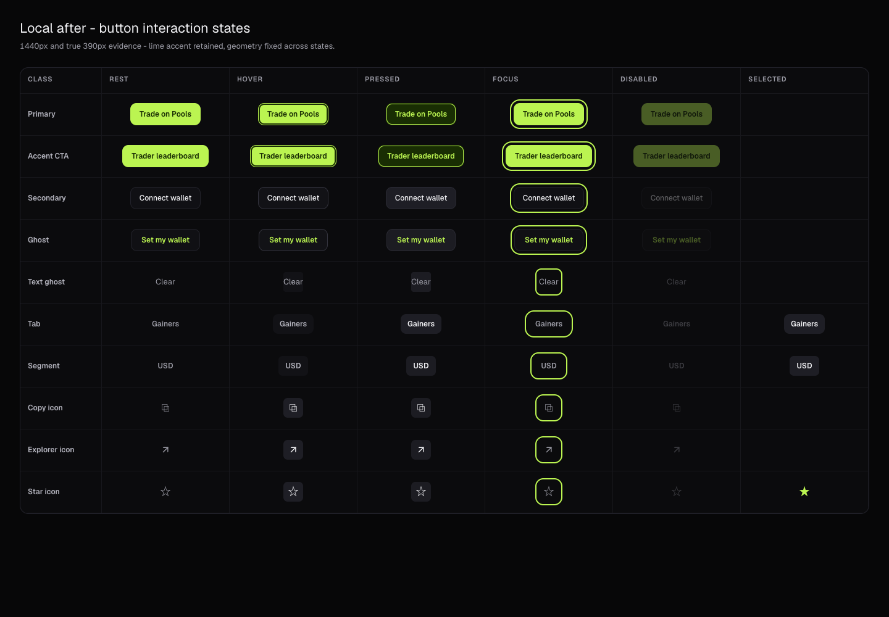
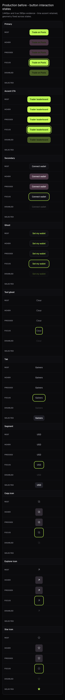
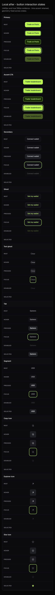

# Button interaction evidence

Production was reproduced before editing at 1440px and a true 390px viewport. The exact cascade defect was the legacy `.button:hover { background: #44303d; }` rule: the later hover rule added `filter: brightness(1.08)` but never restored the lime background. Production therefore computed the primary hover as `rgb(68, 48, 61)` plus `brightness(1.08)` at both widths. The same shared selector reached secondary buttons.

## Before and after state grid

The grid uses the application's real button class names and displays rest, hover, pressed, focus, disabled, and selected states where each class supports them. `capture-grid.js` is the reproducible chrome-devtools-axi fixture.

| Viewport | Production before | Local after |
| --- | --- | --- |
| 1440px |  |  |
| 390px |  |  |

The inventory covers primary `.button` consumers such as Trade on Pools and Open wallet profile, `.leaderboard-cta`, secondary `.button.secondary`, `.connect-button`, `.text-button`, `.table-tabs`, `.segmented`, and copy, explorer, and star `.icon-button` consumers.

## Export tokens

The semantic interaction aliases use the current lime export tokens and neutral ramp, never the stale pink accent:

- Primary: `accent #bbf451` and `accentDeep #192e03`
- Secondary and ghost: `panelRaised #101014`, `panelHover #121216`, `surface5 #1c1c22`, and `surface6 #1e1e25`
- Borders: `lineStrong #22222a`, `lineHover #33333d`, and `lineActive #2a2a33`
- Content: `text #f2f2f5`, `text2 #b4b4be`, and `text3 #9a9aa4`
- Focus: `accent #bbf451`, 2px solid with the existing 4px offset
- Disabled: the existing `0.35` opacity, with hover and pressed treatments suppressed

The lime primary hover keeps its base fill and gains a 2px inset `accentDeep` ring. Pressed primary controls invert to `accentDeep` with lime content. Neutral controls step through the opaque neutral ramp, without translucent overlays or filters.

## Measurements

- Primary hover after, 1440px: `#bbf451` background, `#192e03` content, `none` filter, 2px inset `#192e03` ring, `147.921875 x 38px`
- Primary hover after, 390px: same colors and ring, `147.921875 x 44px`
- Primary rest and hover contrast: `11.28:1`
- Secondary rest contrast: `16.99:1`
- Ghost rest contrast: `14.62:1`
- Neutral hover contrast: `9.09:1`
- Neutral pressed contrast: `14.83:1`
- Focused interaction tests assert a visible 2px lime focus ring and exact width and height equality across states
- Full layout-stability coverage reports CLS 0 for the representative desktop and mobile routes

## Validation

- `pnpm check`
- `pnpm exec playwright test tests/e2e/button-interactions.spec.ts --workers=1` - 6 passed
- `pnpm exec playwright test --workers=1` - 370 passed, 20 intentionally skipped
